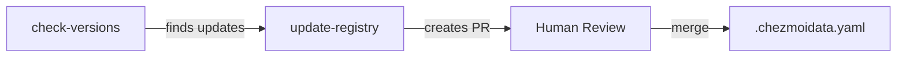

# GitHub Automation

Professional, modular tool version management system.

## Architecture

```
.github/
└── workflows/
    ├── check-versions.yml    # Checks for updates (read-only)
    ├── update-registry.yml   # Creates PRs for updates
    └── validate-registry.yml # Validates registry integrity
```

## Core Concepts

### 1. **Tools Registry** (`.chezmoidata.yaml`)
The single source of truth containing:
- Tool metadata (type, source, description)
- Current versions
- Version patterns for validation
- All configuration in one place
- Direct integration with Chezmoi templates

### 2. **Workflow Separation**
Each workflow has a single, clear responsibility:

| Workflow | Purpose | Trigger |
|----------|---------|---------|
| `check-versions` | Check for updates | Daily + Manual + Called by others |
| `update-registry` | Create update PRs | Daily + Manual |
| `validate-registry` | Validate structure | On PR/push |

## Usage

### Adding a New Tool

1. Add to `.chezmoidata.yaml`:
```yaml
newtool:
  description: "Tool description"
  type: github  # or 'npm'
  repo: owner/repo  # for github
  package: package-name  # for npm
  version: "1.0.0"  # current version
  pattern: "^[0-9]+\\.[0-9]+\\.[0-9]+$"  # version validation
```

2. Run `chezmoi apply` to use the new tool

### Removing a Tool

1. Remove from `.chezmoidata.yaml`
2. Remove from installation scripts
3. Run `chezmoi apply`

## How It Works

### Update Flow


1. **Daily Check**: `check-versions` runs daily at 9 AM UTC
2. **Update PR**: If updates found, `update-registry` creates a PR
3. **Review**: Humans review and merge the PR
4. **User Update**: Users run `chezmoi update` to get new versions

### Features

- **Modular**: Each workflow does one thing well
- **Resilient**: Retry logic, graceful failure handling
- **Validated**: Automatic validation on changes
- **Professional**: Clean logs, summaries, and PRs
- **Centralized**: All tool data in one registry

## Manual Operations

```bash
# Check for updates
gh workflow run check-versions.yml


# Create update PR
gh workflow run update-registry.yml
```

## Version Patterns

The registry supports regex patterns for version validation:
- `^[0-9]+\.[0-9]+\.[0-9]+$` - Semantic versioning (1.2.3)
- `^v[0-9]+\.[0-9]+\.[0-9]+$` - v-prefixed (v1.2.3)

## Benefits

1. **Single Source of Truth**: All tool data in `.chezmoidata.yaml`
2. **Direct Chezmoi Integration**: No sync needed between files
3. **Clear Separation**: Each workflow has one job
4. **Easy Maintenance**: Add/remove tools in one place
5. **Automatic Validation**: Catches errors early
6. **Professional Quality**: Enterprise-grade automation